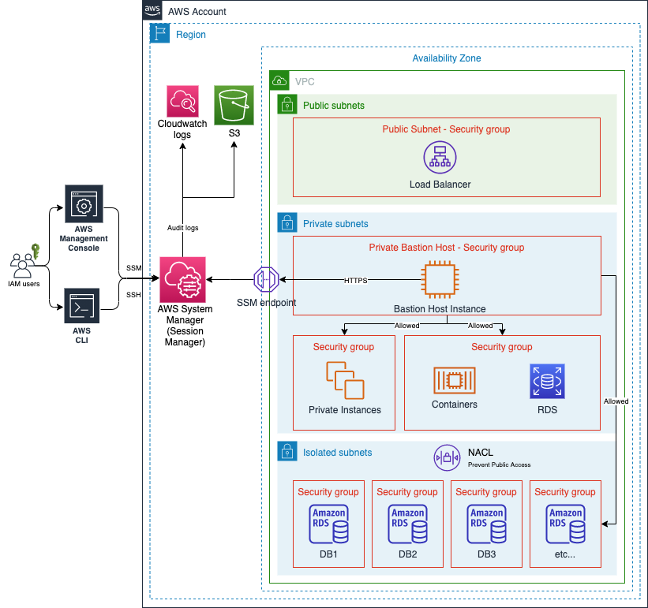
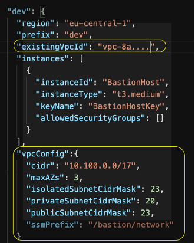
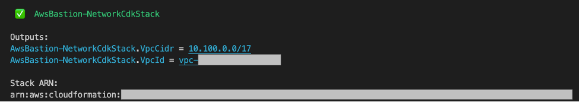
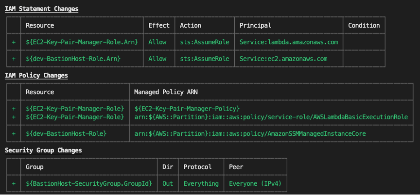
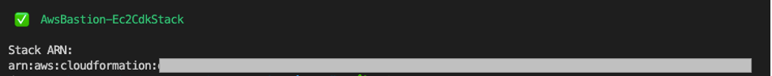

# aws-cdk-ts
aws cdk for typescript

# 作業環境
- npm
- docker / docker-compose
- AWS CLI
- AWS CDK Local
  - https://github.com/localstack/aws-cdk-local
  1. `aws-cdk-local`をインストール
		```bash
		$ npm install aws-cdk-local

		added 2 packages, and audited 3 packages in 2s

		found 0 vulnerabilities
		```
	1. `aws-cdk`をインストール
		```bash
		$ npm install aws-cdk
		added 1 package, and audited 4 packages in 4s

		found 0 vulnerabilities
		```
- poetry
  - `Localstack CLI`インストール
	```bash
	$ poetry add localstack
	```
  - `awscli-local`インストール
	```bash
	$ pip install awscli-local
	```
# 前提条件
- CDK: Typescript
- Localstackの起動/停止: `Localstack CLI`
- aws cli: `awscli-local` -> `awslocal xx xxxx`

# CDKのセットアップ
1. ディレクトリ作成
   ```bash
   $ mkdir cdk-sample
   ```
1. cdkの初期化
   ```bash
   $ cd cdk-sample
   $ npx cdklocal init sample-app --language typescript
   ```
1. cdkの`bootstrap`
   ```bash
   $ npx cdklocal bootstrap
    ⏳  Bootstrapping environment aws://000000000000/us-east-1...
	Trusted accounts for deployment: (none)
	Trusted accounts for lookup: (none)
	Using default execution policy of 'arn:aws:iam::aws:policy/AdministratorAccess'. Pass '--cloudformation-execution-policies' to customize.
	CDKToolkit: creating CloudFormation changeset...
	✅  Environment aws://000000000000/us-east-1 bootstrapped.
   ```
1. サンプルのスタックのデプロイ
   ```bash
   $ npx cdklocal synth
   $ npx cdklocal deploy
   ✨  Synthesis time: 7.58s

	This deployment will make potentially sensitive changes according to your current security approval level (--require-approval broadening).
	Please confirm you intend to make the following modifications:

	IAM Statement Changes
	┌───┬───────────────────────┬────────┬─────────────────┬───────────────────────────┬───────────────────────────────────────────────────────┐
	│   │ Resource              │ Effect │ Action          │ Principal                 │ Condition                                             │
	├───┼───────────────────────┼────────┼─────────────────┼───────────────────────────┼───────────────────────────────────────────────────────┤
	│ + │ ${CdkSampleQueue.Arn} │ Allow  │ sqs:SendMessage │ Service:sns.amazonaws.com │ "ArnEquals": {                                        │
	│   │                       │        │                 │                           │   "aws:SourceArn": "${CdkSampleTopic}"                │
	│   │                       │        │                 │                           │ }                                                     │
	└───┴───────────────────────┴────────┴─────────────────┴───────────────────────────┴───────────────────────────────────────────────────────┘
	(NOTE: There may be security-related changes not in this list. See https://github.com/aws/aws-cdk/issues/1299)

	Do you wish to deploy these changes (y/n)? y
	```
1. localstackの状態確認
   - `bootstrap`のバケットが作成されていることを確認
		```bash
		$ awslocal s3 ls
		2022-08-21 15:33:30 test-aws-local-cli
		2022-08-21 15:46:29 cdk-hnb659fds-assets-000000000000-us-east-1
		```
   - AWS SQSサービスでQueueが作成されていることを確認
		```bash
		$ awslocal sqs list-queues
		{
			"QueueUrls": [
				"http://localhost:4566/000000000000/CdkSampleStack-CdkSampleQueue5EE69D51-4ce02b21"
			]
		}
		```
1. サンプルスタックの削除
   	```bash
   	$ npx cdklocal destroy
	Are you sure you want to delete: CdkSampleStack (y/n)? y
	CdkSampleStack: destroying...

	✅  CdkSampleStack: destroyed
	```

# CDKで踏み台EC2作成(ssm経由のSSH接続を想定)
- 参考
	- https://aws.amazon.com/jp/blogs/infrastructure-and-automation/deploy-bastion-hosts-into-private-subnets-with-aws-cdk/
	- CDKサンプル
		- https://github.com/aws-samples/secure-bastion-cdk
```text
この後の演習では、CDK を使って 2 つのスタックをデプロイします。

・スタックA（"AwsBastion-NetworkCdkStack"）には、Amazon Virtual Private Cloud（VPC）が含まれています。このスタックはオプションで、既存のVPCがある場合は、ウォークスルーステップ2で説明したように、"cdk.json "に "existingVpcId" を設定すれば、これを使用できます。
・スタックB（「AwsBastion-EC2CdkStack」）には、Bastionホストとして動作するAmazon Elastic Compute Cloud（Amazon EC2）とそのために必要なリソースがすべて含まれています。カスタムリソースEC2-Key-Pair、IAMロールおよびIAMポリシー、セキュリティグループ
以下は、このソリューションのハイレベルなアーキテクチャです。
```

```text
この図が示すように、AWSの標準的なVPC設計では、特定の地域を考慮し、VPCには3種類のサブネットが含まれています。
パブリックサブネットは、インターネットロードバランサーのようなパブリックリソースが含まれています。
プライベートサブネットには、プライベートリソースが含まれ、ここではBastion Hostインスタンスをデプロイしています。
そして最後に、分離されたサブネットには、インバウンドおよびアウトバウンドのインターネットトラフィックから分離する必要があるリソースが配置されます。
cdk.json "の設定セクションでは、下図のようにBastion Hostがアクセスできるリソース "allowedSecurityGroups "を定義することができます。
```
### Step1. デプロイ環境の設定
1. IAMユーザーの作成
    1. "AdministratorAccess"のポリシーをアタッチ
      	- プログラムによるサービスへのアクセス権限のため
      	- 本来は適切なポリシーを作成して、アタッチしたほうが良い
2. 1.で作成したIAMユーザーのAWS CLIのprofileを作成
   	1. `aws configure`コマンドで作成

3. Githubリポジトリからクローン
	```bash
	$ git clone https://github.com/aws-samples/secure-bastion-cdk
	```

4. リポジトリのルートディレクトリに移動
	```bash
	$ cd secure-bastion-cdk
	```

### Step2. デプロイ先環境の設定
プロジェクトのルートディレクトリにあるcdk.jsonの設定を変更することで、デプロイしたい環境を設定することができます。以下のような典型的な環境の例では、以下のプロパティを作成する必要があります。好きなだけ環境を追加して、このウォークスルーのステップ3で説明するように、「cdk deploy -c environment="{環境名}"」でターゲット環境の設定を参照します。
```json
"dev": {
      "region": "eu-central-1",
      "prefix": "my-demo",
      "existingVpcId": "",
      "instances": [
        {
          "instanceId": "BastionHost",
          "instanceType": "t3.medium",
          "keyName": "BastionHostKey",
          "allowedSecurityGroups": []
        }
      ],
      "vpcConfig":{
        "cidr": "10.100.0.0/17",
        "maxAZs": 3,
        "isolatedSubnetCidrMask": 23,
        "privateSubnetCidrMask": 20,
        "publicSubnetCidrMask": 23,
        "ssmPrefix": "/core/network"
      }
    }
```
(existingVpcId)プロパティに値を設定することで、プライベートサブネットを持つ既存のVPCを使用して、その上にBastionホストをプロビジョニングすることができますので、ご注意ください。
しかし、新しいVPCにソリューションをデプロイしたい場合は、(vpcConfig)プロパティを設定することでデプロイすることができます。次に、以下の「ソリューションのデプロイ」の設定に従って、「AwsBastion-NetworkCdkStack」を先にデプロイし、VPCをプロビジョニングします。以下はその例です。

もし、"existingVpcId "に何らかの値があれば、それは新しいVPCを作成する2番目の方法よりも使用されるでしょう。(allowedSecurityGroups) に、Bastionホストが通信することを許可するプライベート・リソースのセキュリティ・グループIDをすべて追加します。
### Step3. ソリューションのデプロイ
1. step1.で作成したprofileを使用してソリューションをデプロイ
	```bash
	$ npm install # dependenciesをインストール 
	$ npm test # runs unit tests
	```
1. 踏み台ホストを使用するために新規のVPCをデプロイする場合、以下のように
"AWSBastion-NetworkCdkStack"を先にデプロイする必要がある
	```bash
	$ cdk deploy -c environment="<Environment Name from cdk.json File>" -c account="<ACCOUNT TO DEPLOY Bastion>" AwsBastion-NetworkCdkStack --profile bastion-cdk 
	```
`Do you wish to deploy these changes (y/n)?`と聞かれたら`y'を入力。デプロイが成功した場合は、以下のように表示される

VPCが作成されたら、`AWSBastion-Ec2CdkStack`stackをデプロイすることができる
	```bash
	$ cdk deploy -c environment="<Environment Name from cdk.json File>" -c account="<ACCOUNT TO DEPLOY Bastion>" AwsBastion-Ec2CdkStack --profile bastion-cdk 
	```
以下に示すようなリソースがデプロイされる

`Do you wish to deploy these changes (y/n)?`と聞かれたら`y'を入力。デプロイが成功した場合は、以下のように表示される


### Step4. ソリューションのテスト
ここでは、SSM session managerを使用して踏み台ホストに接続し、プライベートリソースにSSH経由のトンネルで接続する。
1. IAMユーザーに以下のパーミッションをアタッチする必要がある
	```json
	{
		"Version": "2012-10-17",
		"Statement": [
			{
				"Effect": "Allow",
				"Action": [
					"ssm:StartSession"
				],
				"Resource": [
					"arn:aws:ec2:*:{account_id}:instance/*"
				],
				"Condition": {
					"StringLike": {
						"ssm:resourceTag/Name": [
							"BastionHost"
						]
					}
				}
			},
			{
				"Effect": "Allow",
				"Action": [
					"ec2:DescribeInstances",
					"ec2:DescribeImages",
					"ec2:DescribeTags",
					"ec2:DescribeSnapshots"
				],
				"Resource": [
					"*"
				]
			},
			{
				"Effect": "Allow",
				"Action": [
					"ssm:StartSession"
				],
				"Resource": [
					"arn:aws:ssm:*::document/AWS-StartPortForwardingSession",
					"arn:aws:ssm:*::document/AWS-StartSSHSession"
				]
			},
			{
				"Effect": "Allow",
				"Action": [
					"ssm:TerminateSession"
				],
				"Resource": [
					"arn:aws:ssm:*:*:session/${aws:username}-*"
				]
			},
			{
				"Effect": "Allow",
				"Action": [
					"secretsmanager:GetSecretValue",
					"secretsmanager:DescribeSecret",
					"secretsmanager:ListSecretVersionIds",
					"secretsmanager:ListSecrets"
				],
				"Resource": [
					"arn:aws:secretsmanager:*:{account_id}:secret:*"
				],
				"Condition": {
					"StringEquals": {
						"secretsmanager:ResourceTag/{tag_key}": "{tag_value}"
					}
				}
			}
		]
	}
	```
tagを使用して特定のプライベートリソースへのアクセスを制限したい場合は、
`{tag_key}`に値を追加してください。
そうでない場合、この条件を削除すると、ユーザーは指定されたアカウント内のすべてのプライベートリソースに対する権限を持つことになります。（推奨しない）

1. ローカルマシン（Bastionホストへの接続テストに使用するマシン）に、手順1で作成したユーザーのクレデンシャルでAWSプロファイルを設定していることを確認してください。
	```bash
	$ aws configure --profile bastion-test
	```
1. 必要なパラメータを読み込む。セッションマネージャーへの接続には、ec2インスタンスIDが必要です。以下のコマンドで、作成した踏み台ホストのインスタンスIDを変数に格納する
	```bash
	$INSTANCE_ID=$(aws ec2 describe-instances \
         --filter "Name=tag:Name,Values= BastionHost" \
  --query "Reservations[].Instances[?State.Name =='running'].InstanceId[]" \
               --output text --profile bastion-test)
	```
1. System Manager session managerを使用して接続する。以下のコマンドで踏み台ホストに接続できる
	```bash
	aws ssm start-session --target $INSTANCE_ID --profile bastion-test
	```
ポートフォワードしたい場合は以下のコマンドで可能
	```bash
		$INSTANCE_ID=$(aws ec2 describe-instances \
         --filter "Name=tag:Name,Values= BastionHost" \
  --query "Reservations[].Instances[?State.Name =='running'].InstanceId[]" \
               --output text --profile bastion-test)
	```
	`{remote_port_number}`と`{your_local_port_number}`は適宜置き換える
1. ProxyコマンドでSession Managerを起動/データ転送を許可するようにSSH Configファイルを更新して接続する
	```bash
	vim ~/.ssh/config
 
	#Add SSH over Session Manager
	host i-* mi-*
		ProxyCommand sh -c "aws ssm start-session --target %h --document-name AWS-StartSSHSession --parameters 'portNumber=%p'"
	```
1. key-pairを取得する(`AwsBastion-Ec2CdkStack`スタックのデプロイで作成されている)
	```bash
	aws secretsmanager get-secret-value \
	--secret-id ec2-ssh-key/BastionHostKey/private \
	--query SecretString \
	--output text --profile bastion-test > bastion-key-pair.pem
	
	chmod 400 bastion-key-pair.pem
	```
1. ssh接続
   ```bash
   aws secretsmanager get-secret-value \
	--secret-id ec2-ssh-key/BastionHostKey/private \
	--query SecretString \
	--output text --profile bastion-test > bastion-key-pair.pem
	
	chmod 400 bastion-key-pair.pem
   ```
local_port}はローカルポート、{host}はRDSのエンドポイント、{remote_port}は対象のリモートポート（3306 mysqlポートなど）に置き換える必要があります。と聞かれます。ホスト '$INSTANCE_ID ()' の真正性を確立することができません。ECDSAキーのフィンガープリントはSHA256:...です。本当に接続を継続しますか(yes/no/[fingerprint])？yes "を押すと、$INSTANCE_IDが既知のホストのリストに追加されます。

# その他
## Poetry
- poetryの仮想環境起動
  ```bash
  $ poetry shell
  ```

## Localstack
- localstackの起動
  ```bash 
  $ localstack start -d 
        __                     _______ __             __
       / /   ____  _________ _/ / ___// /_____ ______/ /__
	  / /   / __ \/ ___/ __ `/ /\__ \/ __/ __ `/ ___/ //_/
	 / /___/ /_/ / /__/ /_/ / /___/ / /_/ /_/ / /__/ ,<
	/_____/\____/\___/\__,_/_//____/\__/\__,_/\___/_/|_|

	💻 LocalStack CLI 1.0.4

	[15:29:55] starting LocalStack in Docker mode 🐳                                                                               localstack.py:138
			preparing environment                                                                                                bootstrap.py:667
			configuring container                                                                                                bootstrap.py:675
			starting container                                                                                                   bootstrap.py:681
	[15:30:09] detaching   
	```
- 起動確認(別のshellで実行)
  ```bash
  $ localstack status services
    ┏━━━━━━━━━━━━━━━━━━━━━━━━━━┳━━━━━━━━━━━━━┓
	┃ Service                  ┃ Status      ┃
	┡━━━━━━━━━━━━━━━━━━━━━━━━━━╇━━━━━━━━━━━━━┩
	│ acm                      │ ✔ available │
	│ apigateway               │ ✔ available │
	│ cloudformation           │ ✔ available │
	│ cloudwatch               │ ✔ available │
	│ config                   │ ✔ available │
	│ dynamodb                 │ ✔ available │
	│ dynamodbstreams          │ ✔ available │
	│ ec2                      │ ✔ available │
	│ es                       │ ✔ available │
	│ events                   │ ✔ available │
	│ firehose                 │ ✔ available │
	│ iam                      │ ✔ available │
	│ kinesis                  │ ✔ available │
	│ kms                      │ ✔ available │
	│ lambda                   │ ✔ available │
	│ logs                     │ ✔ available │
	│ opensearch               │ ✔ available │
	│ redshift                 │ ✔ available │
	│ resource-groups          │ ✔ available │
	│ resourcegroupstaggingapi │ ✔ available │
	│ route53                  │ ✔ available │
	│ route53resolver          │ ✔ available │
	│ s3                       │ ✔ available │
	│ s3control                │ ✔ available │
	│ secretsmanager           │ ✔ available │
	│ ses                      │ ✔ available │
	│ sns                      │ ✔ available │
	│ sqs                      │ ✔ available │
	│ ssm                      │ ✔ available │
	│ stepfunctions            │ ✔ available │
	│ sts                      │ ✔ available │
	│ support                  │ ✔ available │
	│ swf                      │ ✔ available │
	└──────────────────────────┴─────────────┘
  ```
## AWS CLI Local
- s3バケット作成
  ```bash
  $ awslocal s3 mb s3://test-aws-local-cli
  ```
  - 確認
  ```bash
  $ awslocal s3 ls
  2022-08-21 15:33:30 test-aws-local-cli
  ```


# トラブルシューティング
- `poetry add xxx`の`Resolving dependencies...`が異常に長い場合
  - IPv6の通信の利用をOFF
  - https://zenn.dev/mangolassi/scraps/17b7df8a62b3bf
  ```bash
  sudo sysctl -w net.ipv6.conf.all.disable_ipv6=1
  sudo sysctl -w net.ipv6.conf.default.disable_ipv6=1
  ```
# 参考
- Localstack
  - https://github.com/localstack/localstack
- cdklocal
  - https://github.com/localstack/aws-cdk-local
- awslocal cli
  - https://github.com/localstack/awscli-local
- poetry
  - https://cocoatomo.github.io/poetry-ja/
    - pipではなく、curlのインストール方法でインストール
      - https://cocoatomo.github.io/poetry-ja/#osx-linux-bashonwindows
  - localに`.venv`を作りたい場合
    ```bash
	$ poetry config virtualenvs.in-project true
	$ poetry config --list
	``` 
- aws cdk examples
	- https://github.com/aws-samples/aws-cdk-examples
	- typescript
		- https://github.com/aws-samples/aws-cdk-examples/tree/master/typescript